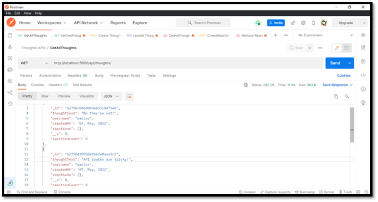
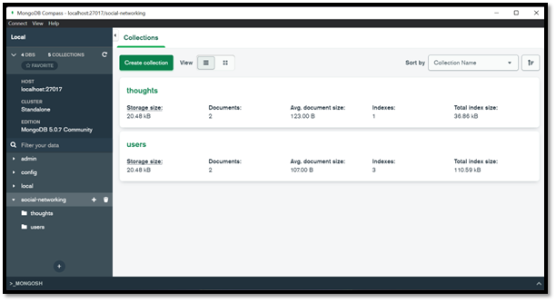

# MongoDB-Social-Networking-API

## Table of Contents

- [Description](#description)
- [Installation](#installation)
- [Usage](#usage)
- [Videos](#videos)
- [Example](#examples)
- [Contact Information](#contact)

## Description

This application is an social networking API that allows users to share their thoughts, react to friends’ thoughts and create a friend list. The application uses Express.js for routing, a MongoDB database and Mongoose ODM. In addition to using the Express.js and Mongoose packages, the app uses DateJS package to format timestamps. Furthermore, as this is not a deployed application, a walk through video of the application of the in action can be found below.

## Installation

- open a terminal 
- node.js needs to be installed prior to use
- clone the repo: `https://github.com/NAli3107/MongoDB-Social-Networking-API`
- download npm JSON packages by entering `npm i or npm install`
- enter `npm start` to start the server.js file which will then start API on `localhost PORT 5000`

## Usage

When users enter the command to invoke the application, then the server is started and the Mongoose models are synced to the MongoDB database. Once users open API GET routes in Insomnia or POSTMAN for users and thoughts, then the data for each of these routes is displayed in a formatted JSON. Users can run API POST, PUT, and DELETE routes in Insomnia or POSTMAN to successfully create, update, and delete users, thoughts and friends in the database.

## Videos

Walk through video of app:

[Social-Networking Video1 Link](https://drive.google.com/file/d/1jaeDIMMeh9nAtQ8oQufOCfABZ2tqhBi5/view)

[Social-Networking Video2 Link](https://drive.google.com/file/d/1G5skGGKHmm8C7Qx9iKRol2HGYgftS8cF/view)

## Examples

Screenshot of Postman:

Screenshot of MongoDB:

## Contact

Email Address: Nadiraali188a@gmail.com

Linkedin Profile: [LinkedIn](https://www.linkedin.com/in/nadira-ali-09a182106/)

Github: [Profile](https://github.com/NAli3107)

Github: [Repo](https://github.com/NAli3107/MongoDB-Social-Networking-API)
